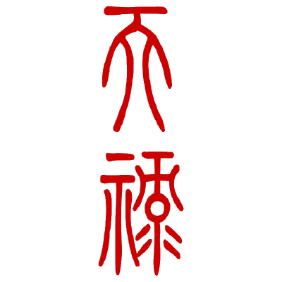
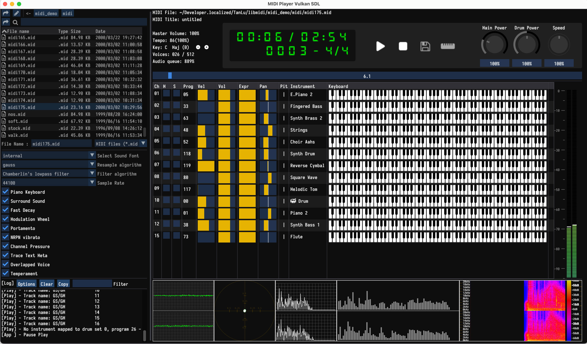
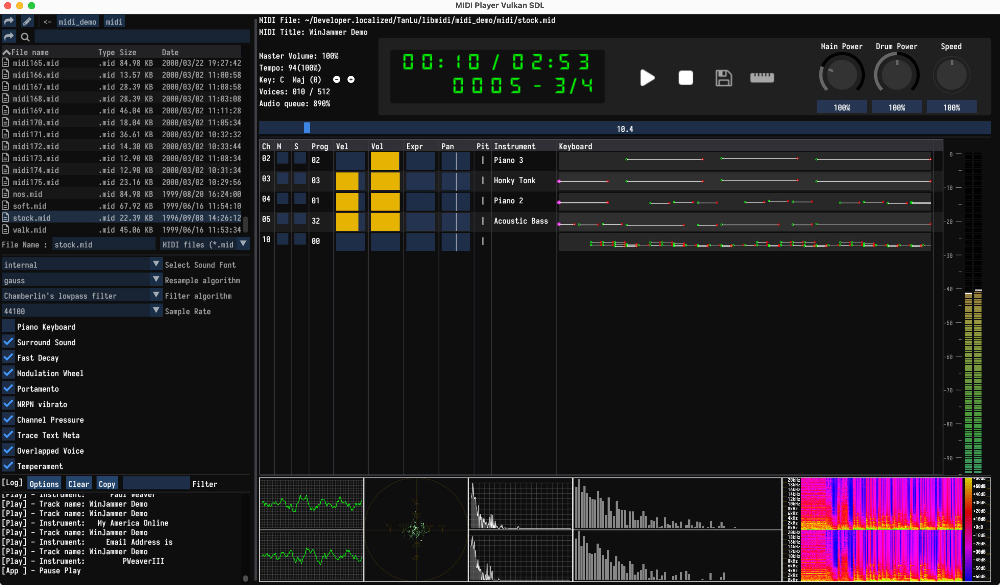
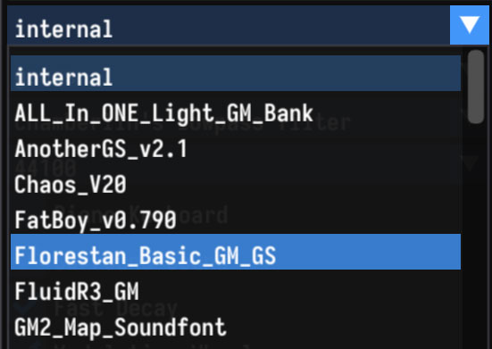
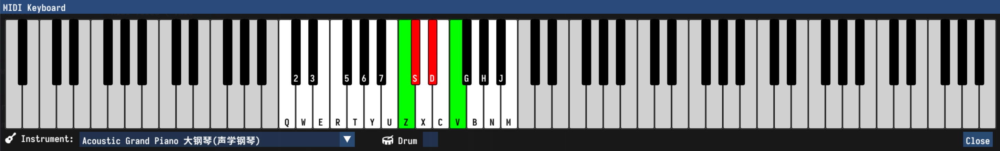
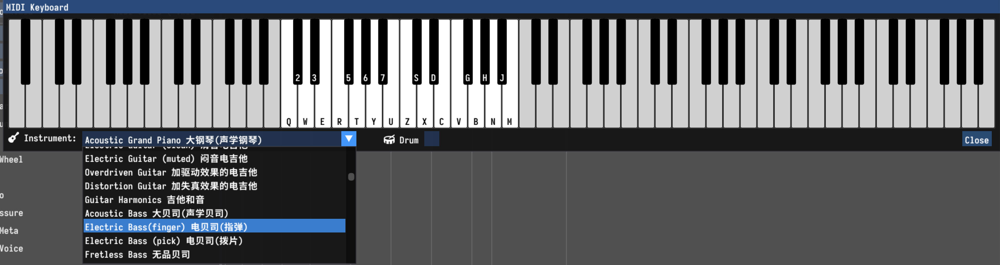
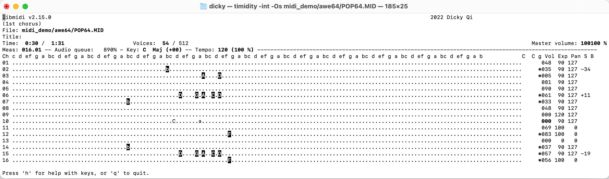

<div align="left">
  
  <div>&nbsp;</div>
</div>
<div align="left">

</div>

# Introduction
MIDI player base on timidity and imgui, support soundfont(SF2) and software MIDI keyboard.

- **App main window with paino keyboard view**

  

- **App main window with event rolling**

  

- **Soundfont Select**

  

- **Software MIDI keyboard**

  

- **Software MIDI keyboard instrument**

  

- **Console demo**

  

# Getting the Source

```bash
git clone --recurse-submodules https://github.com/tanluteam/libmidi
```

# Building

This project supports [CMake](https://cmake.org/) out of the box.

- **Linux**

Install dependence library ncurses with apt

- **MacOS**

Install dependence library ncurses with homwbrew

- **Windows**

Using MSYS64 + Mingw64 + Clang/GCC
Install dependence library with pacman

- **imgui build**

See imgui document [imgui](https://github.com/tanluteam/imgui/blob/master/docs/README.md)

### Quick start:

```bash
mkdir -p build && cd build
cmake -DCMAKE_BUILD_TYPE=Release .. && cmake --build .
./build/immidi
./build/timidity
```

# LICENSE

This project is released under [The MIT License](LICENSE)。
